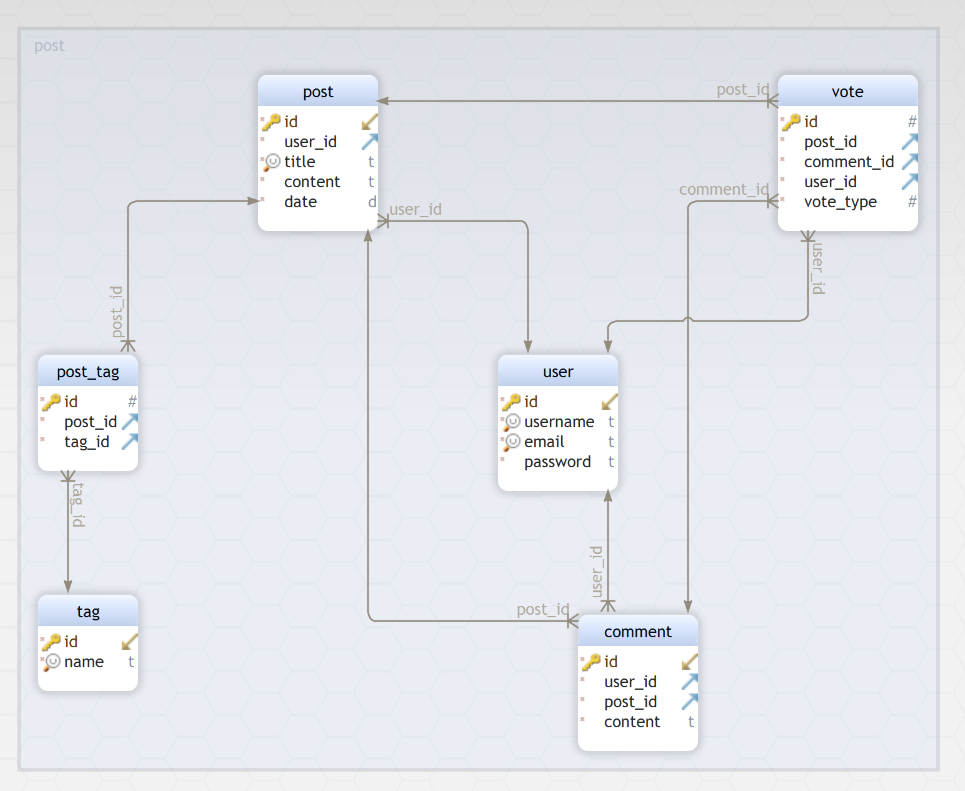

# forum

Info

### Objectives

This project consists in creating a web forum that allows :

- communication between users.
- associating categories to posts.
- liking and disliking posts and comments.
- filtering posts.

#### SQLite

In order to store the data in your forum (like users, posts, comments, etc.) you will use the database library SQLite.

SQLite is a popular choice as an embedded database software for local/client storage in application software such as web browsers. It enables you to create a database as well as controlling it by using queries.

To structure your database and to achieve better performance we highly advise you to take a look at the [entity relationship diagram](https://www.smartdraw.com/entity-relationship-diagram/) and build one based on your own database.

- You must use at least one SELECT, one CREATE and one INSERT queries.

To know more about SQLite you can check the [SQLite page](https://www.sqlite.org/index.html).

#### Authentication

In this segment the client must be able to `register` as a new user on the forum, by inputting their credentials. You also have to create a `login session` to access the forum and be able to add posts and comments.

You should use cookies to allow each user to have only one opened session. Each of this sessions must contain an expiration date. It is up to you to decide how long the cookie stays "alive". The use of UUID is a Bonus task.

Instructions for user registration:

- Must ask for email
  - When the email is already taken return an error response.
- Must ask for username
- Must ask for password
  - The password must be encrypted when stored (this is a Bonus task)

The forum must be able to check if the email provided is present in the database and if all credentials are correct. It will check if the password is the same with the one provided and, if the password is not the same, it will return an error response.

#### Communication

In order for users to communicate between each other, they will have to be able to create posts and comments.

- Only registered users will be able to create posts and comments.
- When registered users are creating a post they can associate one or more categories to it.
  - The implementation and choice of the categories is up to you.
- The posts and comments should be visible to all users (registered or not).
- Non-registered users will only be able to see posts and comments.

#### Likes and Dislikes

Only registered users will be able to like or dislike posts and comments.

The number of likes and dislikes should be visible by all users (registered or not).

#### Filter

You need to implement a filter mechanism, that will allow users to filter the displayed posts by :

- categories
- created posts
- liked posts

You can look at filtering by categories as subforums. A subforum is a section of an online forum dedicated to a specific topic.

Note that the last two are only available for registered users and must refer to the logged in user.

#### Docker

For the forum project you must use Docker. You can read about docker basics in the [ascii-art-web-dockerize](../ascii-art-web/dockerize/README.md) subject.

### Instructions

- You must use **SQLite**.
- You must handle website errors, HTTP status.
- You must handle all sort of technical errors.
- The code must respect the [**good practices**](../good-practices/README.md).
- It is recommended to have **test files** for [unit testing](https://go.dev/doc/tutorial/add-a-test).

### Allowed packages

- All [standard Go](https://golang.org/pkg/) packages are allowed.
- [sqlite3](https://github.com/mattn/go-sqlite3)
- [bcrypt](https://pkg.go.dev/golang.org/x/crypto/bcrypt)
- [UUID](https://github.com/satori/go.uuid)

This project will help you learn about:

- The basics of web :
  - HTML
  - HTTP
  - Sessions and cookies
- Using and [setting up Docker](https://docs.docker.com/get-started/)
  - Containerizing an application
  - Compatibility/Dependency
  - Creating images
- SQL language
  - Manipulation of databases
- The basics of encryption

How to run

### Run go files:
  1. Write to the terminal `make run`
  2. Open the browser
  3. in the address bar, write `localhost:8080`

### Run docker:
  #### Attention: you must have docker compose installed
  1. Write to the terminal `make docker`
  2. Open the browser
  3. in the address bar, write `localhost:8081`

Build a project

  1. Write to the terminal `make build`
  2. Write to the terminal `./bin/main`
  3. Open the browser
  4. in the address bar, write `localhost:8080`

How to view the docker catalog

  
  1. Write to the terminal `make docker-catalog`
  

How to stop docker

  
  1. Write to the terminal `make docker-stop`

How to remove docker

  
  1. Write to the terminal `make docker-delete`
  

how to remove docker volume

  
  1. Write to the terminal `make docker-delete-volume`
  

How to change the port

  1. Write to the terminal `go run ./cmd -addr=:port`
  2. Open the browser
  3. in the address bar, write `localhost:port`

## ERD - Entity Relationship Diagram

## Please note 
*Category* feature as per project requirements has been replaced by *tags* features (to be able adding any tags)

## Where to view commits
All commits can be viewed here https://github.com/erdauletbatalov/forum
Most commits are in https://git.01.alem.school/erdauletbatalov/forum

